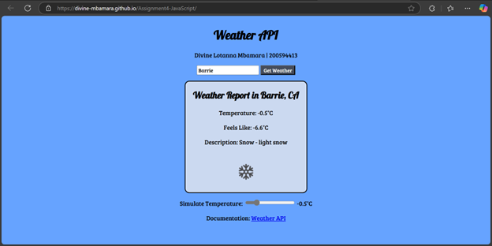

# APIs 
### DESCRIPTION 
On your own, pick a popular Web app or service that offers a publicly available API. Create a
simple page that demonstrates how to connect with the API using JavaScript. You may follow a
simple tutorial that is provided by the same organization that built the API.

### LIVE DEMO
You can view the live version of the project here: [Live Demo](https://divine-mbamara.github.io/Assignment4-JavaScript/)

### PROJECT PREVIEW

### INSTRUCTIONS 
1. Create an html file (index.html) and two folders which contain CSS and JavaScript for the
assignment.
2. Dynamically add your student id and name somewhere on the index page using a p tag and
JavaScript.
3. Choose a Web app or service that offers a friendly API with good documentation. If you are
unsure whether your choice is appropriate, ask your professor.
4. Find within the documentation, a simple “getting started” section that shows how to obtain a
key for the API, how to connect, and how to use it to obtain data.
5. Follow the documentation to create your own demonstration page on a Web server, using your
own API key.
6. Learn how to make one or more calls to the API.
7. Output some data or information from the Web service to your page to demonstrate that it is
working.
8. Include a link to the tutorial or documentation page that you followed to create your page
(very important – this demonstrates academic integrity).
9. The JavaScript and CSS file should be linked to the html. Don’t forget to use defer if you are
adding script in the head section.
10. Once you’ve completed the functionality of the interface, add some CSS to make the page
visually attractive (don’t spend too much time on this – the focus is the JS). 
